# Mymir — AI Editorial Assistant

Mymir is an editorial assistant designed to curate and interact with the latest news, trends and AI projects from the last 7 days.

## Key Features

- **Smart Editorial Chat:** Interact with a specialized AI agent for high-quality content curation.
- **Intelligent Caching:** Boosted performance using Redis to serve identical requests in milliseconds.
- **n8n Orchestration:** Complex logic flows and tool execution powered by n8n.
- **Multi-Source Research:** Real-time data from Tavily Search, MediaStack, and GNews APIs.
- **Contextual Memory:** Persistent conversation history managed by session IDs.

## How it Works

Mymir uses a decision-based architecture. When a request arrives, the system first checks if a valid cache exists for that specific user and path. If it's a new or unique query, the **Gemini 2.0 Flash** agent takes over, deciding which research tools to trigger to provide the most accurate editorial response.

## Technology Stack

- **Backend:** FastAPI (Python 3.11+)
- **Database:** PostgreSQL (SQLAlchemy ORM)
- **Cache & Memory:** Redis 7.0
- **AI Model:** Google Gemini 2.0 Flash
- **Workflow Engine:** n8n
- **Research Tools:** Tavily, MediaStack, GNews APIs

## Architecture



### Step-by-Step Flow:

1. **Webhook Entry:** The backend sends a POST request with `user_id`, `session_id`, and `path`.
2. **Cache Check:** Redis verifies if `cache:user_id:path` exists (TTL 1h).
3. **Agent Execution:** If no cache, the Gemini Agent analyzes the query.
4. **Tool Trigger:** The agent calls Tavily, MediaStack, or GNews as needed.
5. **Memory Retrieval:** Chat context is fetched from Redis Chat Memory.
6. **Response & Cache:** The response is sent, and if it's a primary path, it's stored in Redis.

## Folder Structure

```text
mymir/
├── backend/
│   ├── app/
│   │   ├── controllers/  # Route handlers
│   │   ├── core/         # Config, Database & Redis setup
│   │   ├── middleware/   # JWT Auth
│   │   ├── models/       # SQLAlchemy Entities
│   │   ├── schemas/      # Pydantic Models
│   │   ├── services/     # n8n & External integrations
│   │   └── main.py       # App entry point
│   ├── .env              # Environment Variables
│   └── requirements.txt  # Python Dependencies
├── assets/               # Architecture diagrams & icons
├── docker-compose.yml    # Infrastructure (Redis, n8n)
└── README.md
```

## License

Distributed under the **MIT License**. See `LICENSE` for more information.

<div align="center">
  <br />
  <h1>🇧🇷 Versão em Português</h1>
  <br />
</div>

# Mymir — Assistente Editorial de IA

O Mymir é um assistente editorial projetado para curar e interagir com as últimas notícias, tendências e projetos de IA dos últimos 7 dias.

## Funcionalidades Principais

- **Chat Editorial Inteligente:** Interação com um agente de IA especializado em curadoria de conteúdo.
- **Cache Inteligente:** Performance otimizada usando Redis para servir requisições idênticas em milissegundos.
- **Orquestração n8n:** Fluxos de lógica complexos e execução de ferramentas alimentados pelo n8n.
- **Pesquisa Multi-Fonte:** Dados em tempo real das APIs Tavily Search, MediaStack e GNews.
- **Memória Contextual:** Histórico de conversa persistente gerenciado por IDs de sessão.

## Como Funciona

O Mymir utiliza uma arquitetura baseada em decisão. Quando uma requisição chega, o sistema verifica primeiro se existe um cache válido para aquele usuário e caminho. Se for uma consulta nova, o agente **Gemini 2.0 Flash** assume o controle, decidindo quais ferramentas de pesquisa acionar para fornecer a melhor resposta editorial.

## Stack de Tecnologia

- **Backend:** FastAPI (Python 3.11+)
- **Banco de Dados:** PostgreSQL (SQLAlchemy ORM)
- **Cache e Memória:** Redis 7.0
- **Modelo de IA:** Google Gemini 2.0 Flash
- **Orquestrador:** n8n
- **Ferramentas de Pesquisa:** APIs Tavily, MediaStack, GNews

## Arquitetura


### Fluxo Passo a Passo:

1. **Entrada Webhook:** O backend envia um POST com `user_id`, `session_id` e `path`.
2. **Verificação de Cache:** O Redis verifica se `cache:user_id:path` existe (TTL 1h).
3. **Execução do Agente:** Caso não haja cache, o agente Gemini analisa a consulta.
4. **Acionamento de Tools:** O agente chama Tavily, MediaStack ou GNews conforme necessário.
5. **Recuperação de Memória:** O contexto do chat é buscado na Redis Chat Memory.
6. **Resposta e Cache:** A resposta é enviada e, se for um caminho primário, é salva no Redis.

## Estrutura de Pastas

```text
mymir/
├── backend/
│   ├── app/
│   │   ├── controllers/  # Handlers de rotas
│   │   ├── core/         # Config, Database e Redis
│   │   ├── middleware/   # Autenticação JWT
│   │   ├── models/       # Entidades SQLAlchemy
│   │   ├── schemas/      # Modelos Pydantic
│   │   ├── services/     # Integrações (n8n, etc)
│   │   └── main.py       # Ponto de entrada
│   ├── .env
│   └── requirements.txt
├── assets/
├── docker-compose.yml
└── README.md
```

## Licença

Distribuído sob a **Licença MIT**. Veja o arquivo `LICENSE` para mais informações.
